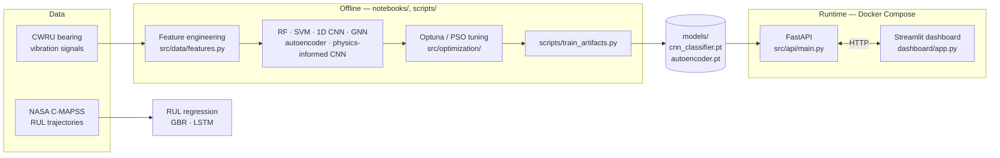

# Fault Detection in Engine Parts (Physics-Informed Deep Learning)

Fault/anomaly detection and diagnosis for mechanical components (bearings and turbofan engine parts) using sensor data, combining classical anomaly detection, deep learning, and physics-informed constraints. Built with architectures and optimization algorithms deliberately distinct from genetic algorithms, to broaden a portfolio started with a thesis on Neuroevolution applied to Physics-Informed Neural Networks (PINNs).

This is **project 1 of a 4-project roadmap**:
1. **Fault detection in engine parts** ← this repo
2. Structural/topological optimization with PINNs
3. Operator Learning (DeepONet / Fourier Neural Operator)
4. Optimizer benchmark (GA vs Bayesian Optimization vs PSO vs CMA-ES)

## Status

**All 6 phases done.** See [fault-detection-engine-parts-plan.md](fault-detection-engine-parts-plan.md) for the full phase-by-phase plan, and each phase's write-up for methodology and detailed findings:

| Phase | Result | Write-up |
|---|---|---|
| 0 — Setup | Repo, env, both datasets acquired | — |
| 1 — Classical baseline | Random Forest / SVM, **0.977** accuracy | [docs/phase1_results.md](docs/phase1_results.md) |
| 2 — Deep learning | 1D CNN + autoencoder; Random Forest still best (0.978) | [docs/phase2_results.md](docs/phase2_results.md) |
| 3 — Graph neural network | Multi-sensor DE+FE GCN, 0.871 | [docs/phase3_results.md](docs/phase3_results.md) |
| 4 — Optimization comparison | Optuna/PSO-tuned CNN, **0.999** — first model to beat RF | [docs/phase4_results.md](docs/phase4_results.md) |
| 5 — Physics-informed extension | Bearing defect-frequency loss, modest gain on a harder split | [docs/phase5_results.md](docs/phase5_results.md) |
| 6 — Productization | API + dashboard + Docker, serving the Phase 4 CNN | [docs/phase6_results.md](docs/phase6_results.md) |
| + C-MAPSS RUL regression (FD001) | Gradient Boosting beats an LSTM (17.0 vs 18.9 RMSE) — same "classical is a hard baseline" story, different dataset | [docs/cmapss_results.md](docs/cmapss_results.md) |
| + C-MAPSS RUL regression (FD002) | 6-regime dataset needs regime-based normalization — halves the LSTM's NASA score (36,963 → 17,196) | [docs/cmapss_fd002_results.md](docs/cmapss_fd002_results.md) |

Four real bugs were found and fixed along the way (SVM feature scaling in Phase 1, a histogram-binning issue in Phase 2, an unseeded-retrain confound in Phase 4, a stale-channel data quirk in Phase 5) — each is documented in its phase's write-up, not just fixed silently.

## Architecture



The classifier served in production is Phase 4's tuned CNN (validated on a held-out-load split, then retrained on all available data for deployment — see [docs/phase6_results.md](docs/phase6_results.md)); the anomaly score is Phase 2's autoencoder; the dashboard's optional "expected defect frequency" readout uses Phase 5's bearing-kinematics equations when RPM is supplied. The C-MAPSS RUL models ([docs/cmapss_results.md](docs/cmapss_results.md)) aren't wired into the API/dashboard yet.

## Datasets

- **CWRU Bearing Dataset** — vibration signals for bearing fault diagnosis (multiple fault types/sizes/loads). Modeled in Phases 1–5.
- **NASA C-MAPSS** — turbofan engine degradation simulation, for Remaining Useful Life (RUL) prediction. FD001 modeled in [docs/cmapss_results.md](docs/cmapss_results.md), FD002 in [docs/cmapss_fd002_results.md](docs/cmapss_fd002_results.md); FD004 downloaded but not yet modeled.

Dataset details (sampling rates, labels, split strategy, known file quirks) are documented in [docs/datasets.md](docs/datasets.md).

## Repo Structure

```
data/            raw and processed datasets (not versioned, see .gitignore)
notebooks/       exploration and per-phase analysis notebooks
scripts/         train_artifacts.py - trains and saves the models/ the API/dashboard serve
models/          saved model weights + metadata (small, versioned - see .gitignore)
src/data/        data loading, windowing, and feature engineering (CWRU + C-MAPSS)
src/models/      classical ML, CNN, autoencoder, GNN, physics-informed CNN, RUL regressors
src/optimization/  Bayesian optimization (Optuna) and PSO (pyswarms) tuning
src/physics/     bearing defect-frequency equations (physics-informed loss + dashboard context)
src/api/         FastAPI inference service + shared prediction logic
tests/           pytest test suite (data processing, models, API, inference)
dashboard/       Streamlit dashboard (calls the API over HTTP)
docker/          Dockerfiles + docker-compose.yml for the API and dashboard
docs/            per-phase results write-ups + dataset documentation
```

## Setup

Dependencies are managed with [uv](https://docs.astral.sh/uv/).

```bash
uv sync
```

> **Note (Windows):** `uv`'s managed-Python installer (`uv python install <version>`) can fail with `Missing expected target directory for Python minor version link` on some machines (Defender real-time scanning appears to lock the freshly extracted interpreter before uv can create its version-alias symlink). If that happens, `uv sync` still works once the interpreter's actual version directory exists under `%APPDATA%\uv\python\` — run `uv python install <version>` once (it downloads and extracts even though the final link step errors), then `uv sync` picks it up directly.

Later phases need optional dependency groups (kept out of the base install to stay light). **Pass every extra you need in one `uv sync` call** — each call re-resolves the environment to exactly the extras listed, so a second call with a different extra will *uninstall* ones from an earlier call:

```bash
uv sync --extra dl --extra gnn --extra opt --extra serve --extra dashboard   # everything
uv sync --extra dl                                                          # just PyTorch (Phase 2+)
```

| Extra | Adds | Needed for |
|---|---|---|
| `dl` | PyTorch (CPU-only wheels — see `[tool.uv.sources]` in `pyproject.toml`) | Phase 2+ |
| `gnn` | PyTorch Geometric | Phase 3 |
| `opt` | Optuna, pyswarms | Phase 4 |
| `serve` | FastAPI, uvicorn | Phase 6 API |
| `dashboard` | Streamlit, requests | Phase 6 dashboard |

Run tests:

```bash
uv run pytest
```

Run a phase's notebook (they're numbered and executed top-to-bottom, outputs saved in place):

```bash
uv run jupyter notebook notebooks/00_data_exploration.ipynb
```

## Running the dashboard + API

1. Train and save the deployed model artifacts (only needs the `dl` extra):

   ```bash
   uv sync --extra dl
   uv run python scripts/train_artifacts.py
   ```

2. Run locally with `uv` (two terminals):

   ```bash
   uv sync --extra dl --extra serve --extra dashboard
   uv run uvicorn src.api.main:app --reload          # terminal 1 — http://localhost:8000/docs
   uv run streamlit run dashboard/app.py             # terminal 2 — http://localhost:8501
   ```

3. Or run both together with Docker Compose (images pin CPU-only PyTorch; the API image is ~2 GB, not ~9.5 GB — see [docs/phase6_results.md](docs/phase6_results.md) for why that matters):

   ```bash
   docker compose -f docker/docker-compose.yml up --build
   ```

   Dashboard at http://localhost:8501, API docs at http://localhost:8000/docs. The dashboard talks to the API over the internal Compose network (`API_URL=http://api:8000`); set `API_URL` yourself if running the dashboard container against an API elsewhere.
